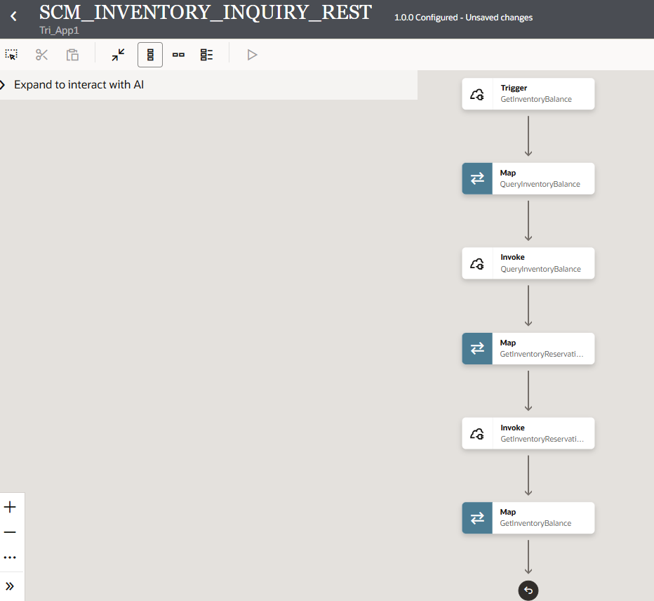
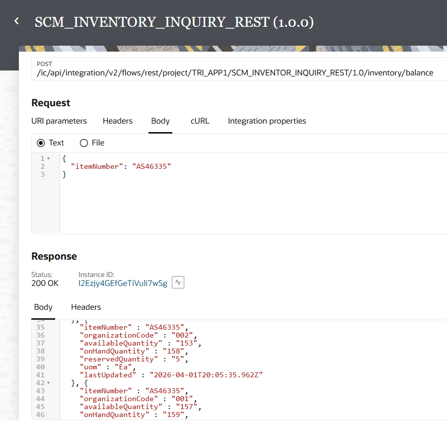
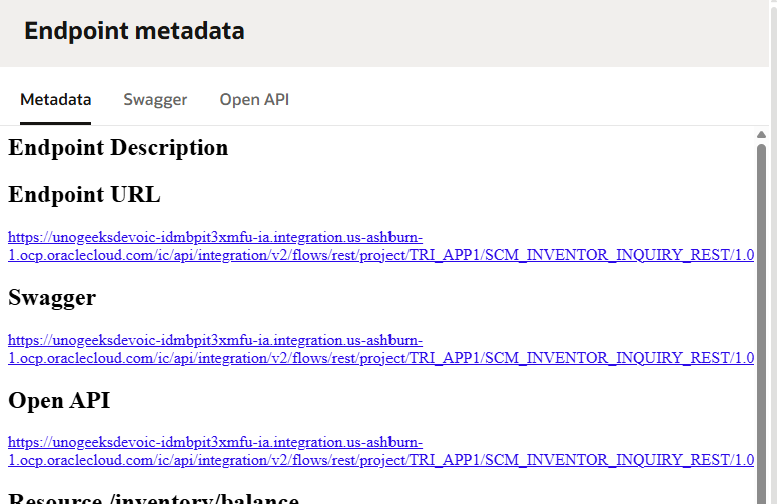
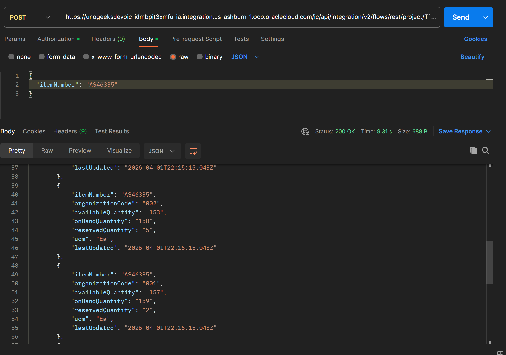

# Inventory Inquiry Integration

## Overview

This project demonstrates a real-world enterprise integration built on **Oracle Integration Cloud (OIC)**, connecting external systems to **Oracle Fusion SCM Cloud** for real-time inventory visibility across all warehouses.

The integration exposes a secure REST API endpoint that any external system — a warehouse mobile app, an e-commerce platform, a customer portal, or an ERP system — can call to instantly retrieve live inventory data without direct access to Oracle Fusion.

---
## Business Problem

In traditional setups, checking inventory requires logging into Oracle Fusion manually, navigating through multiple screens, and reading data warehouse by warehouse. This process is:

- Time-consuming (2–5 minutes per inquiry)
- Not scalable for high-volume order confirmations
- Not accessible to external or non-Fusion systems
- Unable to provide real-time available-to-promise data

---

## Solution

A fully managed, secure OIC integration that acts as a middleware layer between any caller system and Oracle Fusion SCM. The integration handles authentication, data transformation, multi-API orchestration, and response shaping — all transparently.

Any system sends one simple request → OIC returns a clean, structured response with live inventory data across all warehouses in under a second.

---

## Real-World Business Scenario

A **warehouse manager** at a manufacturing company needs to confirm whether enough stock is available across all distribution centers before accepting a large customer order for the *Vario 5500 Tablet (AS46335)*.

Instead of logging into Oracle Fusion and checking each warehouse manually, the order management system calls this OIC integration and instantly receives:

- How many units are **physically on hand** in each warehouse
- How many units are **already reserved** for existing sales orders
- How many units are **actually available** to promise to the new customer

This enables **real-time Available-to-Promise (ATP)** decisions — a critical capability in modern supply chain operations.

---

## Integration Architecture

| Layer | Component |
|---|---|
| Trigger | REST API — POST endpoint exposed by OIC |
| Middleware | Oracle Integration Cloud — App Driven Orchestration |
| Invoke 1 | Oracle Fusion SCM — Inventory On-Hand Balances API |
| Invoke 2 | Oracle Fusion SCM — Inventory Reservations API |
| Response | Structured JSON with calculated quantities per warehouse |

---

## Key Integration Concepts Applied

**Dual API Orchestration** — The integration makes two sequential calls to different Oracle Fusion SCM REST APIs and intelligently combines their responses into a single unified output.

**Dynamic Query Building** — The `q` filter parameter is built dynamically at runtime using the incoming item number, ensuring the right data is fetched for any item.

**Warehouse-Level Aggregation** — Reservation data is aggregated per warehouse using XPath `sum()` with organization-level filtering, so each warehouse gets its own accurate reserved quantity — not a combined total.

**Real-Time Calculation** — Available quantity is calculated on the fly as `On-Hand Quantity minus Reserved Quantity` per warehouse, giving a true available-to-promise figure.

**Secure Middleware** — OIC manages all authentication with Oracle Fusion internally. External callers never need Fusion credentials or knowledge of internal API structures.

---
## Oracle Fusion SCM APIs Used

| API | Purpose | Key Field |
|---|---|---|
| `inventoryOnhandBalances` | Physical stock per warehouse | `PrimaryQuantity` |
| `inventoryReservations` | Stock committed to sales orders | `PrimaryReservationQuantity` |

---

## Sample Business Output

For item **AS46335 (Vario 5500 Tablet)** across all warehouses:

Reserved quantities reflect real active sales orders in Oracle Fusion — summed per warehouse for accuracy.

---

## Key Scenarios Handled

**Scenario 1 — Single Item, All Warehouses**
Query inventory for a specific item across all inventory organizations to get a full stock picture for order promising decisions.

**Scenario 2 — Warehouses With Active Reservations**
Accurately deduct reserved stock (committed to open sales orders) from on-hand quantities per warehouse — not as a global total, but filtered precisely per organization.

**Scenario 3 — Warehouses With No Reservations**
When no sales orders exist for a warehouse, available quantity equals on-hand quantity — handled gracefully with zero-sum logic.

**Scenario 4 — Multiple Sales Orders Per Warehouse**
When a warehouse has multiple active sales orders (e.g., Warehouse 001 has 2 separate orders each reserving 1 unit), all reservations are summed accurately before calculating available stock.

**Scenario 5 — External System Integration**
Any external system — regardless of technology stack — can call this integration using a simple REST POST with Basic Authentication. No Fusion knowledge required on the caller side.

---

## Custom API Testing

---

## Project Outcome

This integration eliminates manual inventory checks, enables real-time order promising, and provides a reusable, scalable REST API that any downstream system can consume. It demonstrates end-to-end OIC integration capability across the full lifecycle — connection setup, orchestration design, dynamic mapping, multi-API coordination, response shaping, and production activation.

---
